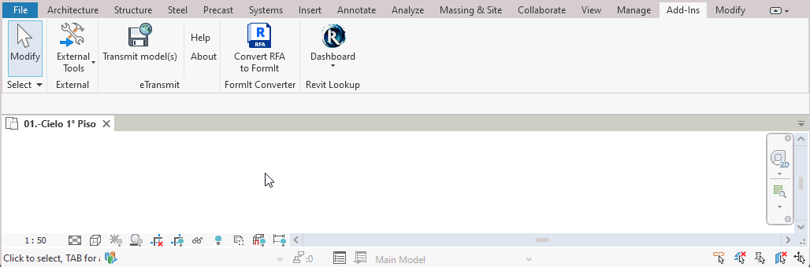
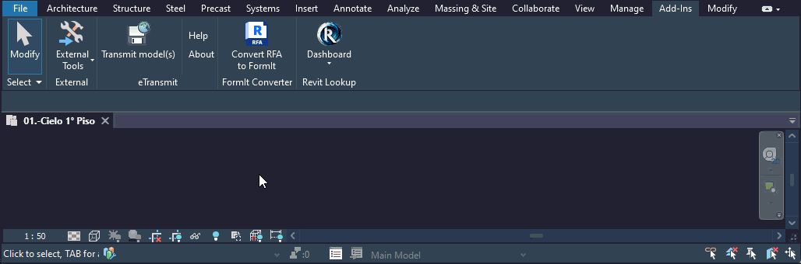

# SCADtools.Revit.UI.OptionsBar
Represents a custom options bar that will be displayed in the native Revit options bar.

Its main methods are: **Show()** and **Hide()**.

The OptionsBar library provides a set of predefined user-friendly controls that can be added to the options bar, such as **ObButton**, **ObLabelCheckBox**, **ObLabelComboBoxImage**, **ObLabelComboBox**, **ObLabelTextBox**, **ObLabelTextBlock**, and **ObSeparator**. Moreover, for users seeking further customization, the library allows the incorporation of user-defined controls. With these features, you can easily integrate a custom options bar into the Revit interface, allowing the user to access different settings without needing to open often annoying dialog boxes. Additionally, this library supports the integration of the custom options bar in conjunction with the native Revit options bar. Below, you'll find some examples of how this options bar is displayed.

For more information on **OptionsBar**, please read our [Wiki](https://github.com/SpeedCAD/SCADtools.Revit.UI.OptionsBar/wiki).

## OptionsBar in Revit 2023+
**Light Theme**



**Dark Theme**



## :floppy_disk: Download
You can reference the DLL in a Visual Studio project the same way you load any external library.
| Version                      | DLL File                                                                                |
|:-----------------------------|:----------------------------------------------------------------------------------------|
| Revit 2023                   | [OptionsBar for Revit 2023](https://github.com/SpeedCAD/SCADtools.Revit.UI.OptionsBar/releases/download/v2.0.0/sc_optionsbar_2.0.0_rvt2023.zip) |
| Revit 2024                   | [OptionsBar for Revit 2024](https://github.com/SpeedCAD/SCADtools.Revit.UI.OptionsBar/releases/download/v2.0.0/sc_optionsbar_2.0.0_rvt2024.zip) |
| Revit 2025                   | [OptionsBar for Revit 2025](https://github.com/SpeedCAD/SCADtools.Revit.UI.OptionsBar/releases/download/v2.0.0/sc_optionsbar_2.0.0_rvt2025.zip) |
| Revit 2026                   | [OptionsBar for Revit 2026](https://github.com/SpeedCAD/SCADtools.Revit.UI.OptionsBar/releases/download/v2.0.0/sc_optionsbar_2.0.0_rvt2026.zip) |

## :rocket: Making
- The DLL files are made using [**Visual Studio**](https://github.com/microsoft) 2026.

## :keyboard: Code example
```c#
using Autodesk.Revit.Attributes;
using Autodesk.Revit.DB;
using Autodesk.Revit.UI;
using SCADtools.Revit.UI.OptionsBar;
using SCADtools.Revit.UI.OptionsBar.Controls;
using System;
using System.Collections.Generic;
using System.Collections.ObjectModel;
using System.Linq;
using System.Windows;
using System.Windows.Media.Imaging;

namespace SCADtools.OptionsBarSample
{
    [TransactionAttribute(TransactionMode.Manual)]
    internal class Sample : IExternalCommand
    {
        public Result Execute(ExternalCommandData commandData, ref string message, ElementSet elements)
        {
            UIApplication uiapp = commandData.Application;
            UIDocument uidoc = uiapp.ActiveUIDocument;
            Document doc = uidoc.Document;

            try
            {
                //Initialize OptionsBar
                using (OptionsBar optionsBar = new OptionsBar())
                {
                    // build options bar
                    BuildOptionsBar(optionsBar);
                    // Show OptionsBar
                    optionsBar.Show("Create Bending Detail");

                    // Some instructions to execute in Revit
                    try
                    {
                        IList<Element> pickElementsByRectangle =
                            uidoc.Selection.PickElementsByRectangle("Select elements.");

                        using (Transaction tr = new Transaction(doc, "Transaction name"))
                        {
                            tr.Start();

                            foreach (Element element in pickElementsByRectangle)
                            {
                                // TODO: Your code logic here
                            }

                            tr.Commit();
                        }
                    }
                    catch (Autodesk.Revit.Exceptions.OperationCanceledException)
                    {
                        return Result.Cancelled;
                    }
                }

                return Result.Succeeded;
            }
            catch (Exception ex)
            {
                message = ex.Message;
                return Result.Failed;
            }
        }

        private void BuildOptionsBar(OptionsBar optionsBar)
        {
            // Initialize a LabelComboBoxImage to display a list of bar images
            ObLabelComboBoxImage labelComboBoxImage = new ObLabelComboBoxImage()
            {
                ItemsTextImage = GetRebarImages(),

                ControlWidth = 220
            };

            // Initialize a Button
            ObButton button = new ObButton("...")
            {
                // To indicate the separation of the Button with some control that is to its left
                MarginLeft = 6,

                ObExpandedToolTip = new ObExpandedToolTip()
                {
                    Title = "Rebar Shape Browser",
                    Content = "Launch/Close Rebar Shape Browser.",
                }
            };
            // Create some event
            button.Click += (s, e) =>
            {
                // Code here
            };

            // Initialize some list of diameters
            ObservableCollection<ComboBoxItemText> comboBoxItemsText = new ObservableCollection<ComboBoxItemText>(
                new List<ComboBoxItemText>()
                {
                    new ComboBoxItemText() { ItemText = "8" },
                    new ComboBoxItemText() { ItemText = "10" },
                    new ComboBoxItemText() { ItemText = "12" },
                    new ComboBoxItemText() { ItemText = "16" }
                });
            // Initialize a LabelComboBox to display a list of diameters
            ObLabelComboBox labelComboBox = new ObLabelComboBox("Diameter:")
            {
                ItemsText = comboBoxItemsText,

                // To indicate the separation of the LabelComboBox with some control that is to its left
                MarginLeft = 10,

                ControlWidth = 52,

                ObExpandedToolTip = new ObExpandedToolTip()
                {
                    Title = "Bar Diameter",
                    Content = "Specifies the bar diameter.",
                }
            };
            // Select first element
            labelComboBox.SelectedItem = comboBoxItemsText.FirstOrDefault();
            // Create some event
            labelComboBox.SelectionChanged += OnSelectionChanged;

            // Initialize a LabelTextBox to indicate bar spacing
            ObLabelTextBox labelTextBox = new ObLabelTextBox("Spacing:", "20")
            {
                // To indicate the separation of the LabelTextBox with some control that is to its left
                MarginLeft = 10,

                ControlWidth = 52,

                ObExpandedToolTip = new ObExpandedToolTip()
                {
                    Title = "Reinforcement Spacing",
                    Content = "Specifies the spacing for rebar.",
                },

                InputMode = ObInputMode.Numeric
            };

            ObLabelCheckBox labelCheckBox = new ObLabelCheckBox("Use amount settings")
            {
                // To indicate the separation of the LabelCheckBox with some control that is to its left
                MarginLeft = 10,

                // Implement controls to manage the IsChecked property
                EnabledElements = new List<UIElement>() { labelComboBox, labelTextBox }
            };

            // Add controls to OptionsBar
            optionsBar.AddControl(new ObSeparator());
            optionsBar.AddControl(labelComboBoxImage);
            optionsBar.AddControl(button);
            optionsBar.AddControl(new ObSeparator());
            optionsBar.AddControl(labelComboBox);
            optionsBar.AddControl(labelTextBox);
            optionsBar.AddControl(labelCheckBox);
        }

        private void OnSelectionChanged(object sender, RoutedEventArgs e)
        {
            var comboBox = sender as ObLabelComboBox;
            var item = comboBox.SelectedItem;
            if (item != null)
            {
                TaskDialog.Show("OptionsBar", $"Selected item is: {item.ItemText}");
            }
        }

        private ObservableCollection<ComboBoxItemTextImage> GetRebarImages()
        {
            string title = "Rebar Shape : ";
            string imageBaseUri = "pack://application:,,,/OptionsBarSample;component/Images/";

            string[] shapes = { "B1", "B2", "B3" };

            return new ObservableCollection<ComboBoxItemTextImage>(
                shapes.Select(shape => new ComboBoxItemTextImage
                {
                    ItemTitle = title,
                    ItemText = shape,
                    ItemImage = new BitmapImage(
                        new Uri($"{imageBaseUri}{shape}.png", UriKind.Absolute)),
                    IsVisibleImageCollapsed = true
                })
            );
        }
    }
}
```
