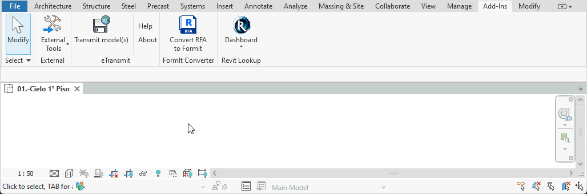

# SCADtools.Revit.UI.OptionsBar
Represents a custom options bar that will be displayed in the native Revit options bar.

Its main methods are: **Show()** and **Hide()**.

The OptionsBar library provides a set of predefined user-friendly controls that can be added to the options bar, such as **Button**, **LabelCheckBox**, **LabelComboBoxImage**, **LabelComboBox**, **LabelTextBox**, and **Separator**. Moreover, for users seeking further customization, the library allows the incorporation of user-defined controls. With these features, you can easily integrate a custom options bar into the Revit interface, allowing the user to access different settings without needing to open often annoying dialog boxes. Additionally, this library supports the integration of the custom options bar in conjunction with the native Revit options bar. Below, you'll find some examples of how this options bar is displayed.

For more information on **OptionsBar**, please read our [Wiki](https://github.com/SpeedCAD/SCADtools.Revit.UI.OptionsBar/wiki).

## OptionsBar in Revit 2023
**Below is the integration of a custom options bar in combination with the native Revit options bar.**


**Below is the integration of a custom options bar to modify an element.**


## OptionsBar in Revit 2024
**Light Theme**



**Dark Theme**


## :floppy_disk: Download
You can reference the DLL in a Visual Studio project the same way you load any external library.
| Version                      | DLL File                                                                                |
|:-----------------------------|:----------------------------------------------------------------------------------------|
| Revit 2023                   | [OptionsBar for Revit 2023](./rvt2023/SCADtools.Revit.UI.OptionsBar.dll?raw=true) |
| Revit 2024                   | [OptionsBar for Revit 2024](./rvt2024/SCADtools.Revit.UI.OptionsBar.dll?raw=true) |

## :rocket: Making
- The DLL files are made using [**Visual Studio**](https://github.com/microsoft) 2022.

## :keyboard: Code example
```c#
using Autodesk.Revit.Attributes;
using Autodesk.Revit.DB;
using Autodesk.Revit.UI;
using SCADtools.Revit.UI;
using System;
using System.Collections.Generic;
using System.Windows;
using System.Windows.Controls;
using System.Windows.Media.Imaging;

namespace SCADtools.OptionsBarSample
{
    [TransactionAttribute(TransactionMode.Manual)]
    internal class Sample : IExternalCommand
    {
        private OptionsBar optionsBar;

        public Result Execute(ExternalCommandData commandData, ref string message, ElementSet elements)
        {
            UIApplication uiapp = commandData.Application;
            UIDocument uidoc = uiapp.ActiveUIDocument;
            Document doc = uidoc.Document;

            try
            {
                //Initialize OptionsBar
                optionsBar = new OptionsBar();

                DisplayOptionsBar();

                //Some instructions to execute in Revit
                IList<Element> pickElementsByRectangle = uidoc.Selection.PickElementsByRectangle("Select elements.");

                //Optionally, you can disable the options bar while Revit is working
                optionsBar.IsEnabled = false;

                using (Transaction tr = new Transaction(doc, "Transaction name"))
                {
                    tr.Start();

                    foreach (Element element in pickElementsByRectangle)
                    {
                        //TODO: Your code logic here
                    }

                    tr.Commit();
                }

                return Result.Succeeded;
            }
            catch (Exception ex)
            {
                message = ex.Message;
                return Result.Failed;
            }
            finally
            {
                //Hide the OptionsBar (IMPORTANT)
                optionsBar.Hide();
            }
        }

        private void DisplayOptionsBar()
        {
            //Initialize a TextBlock to display information at the start of the OptionsBar
            TextBlock textBlock = new TextBlock()
            {
                Text = "Create Bending Detail",
                VerticalAlignment = VerticalAlignment.Center,
                Margin = new Thickness(10, 0, 20, 0)
            };

            //Initialize a LabelComboBoxImage to display a list of bar images
            LabelComboBoxImage labelComboBoxImage = new LabelComboBoxImage()
            {
                ShowLabel = false,
                ItemsTextImage = GetRebarImages(),

                //By default the width is 100
                ComboBoxWidth = 220
            };

            //Initialize a Button
            SCADtools.Revit.UI.Button button = new SCADtools.Revit.UI.Button()
            {
                Label = "...",

                //To indicate the separation of the Button with some control that is to its left
                MarginLeft = 6,
                
                ControlToolTip = new ControlToolTip()
                {
                    Title = "Rebar Shape Browser",
                    Content = "Launch/Close Rebar Shape Browser.",
                }
            };

            //Initialize some list of diameters
            List<ComboBoxItemText> comboBoxItemsText = new List<ComboBoxItemText>()
                {
                    new ComboBoxItemText() { ItemText = "8" },
                    new ComboBoxItemText() { ItemText = "10" },
                    new ComboBoxItemText() { ItemText = "12" },
                    new ComboBoxItemText() { ItemText = "16" }
                };
            //Initialize a LabelComboBox to display a list of diameters
            LabelComboBox labelComboBox = new LabelComboBox()
            {
                Label = "Diameter:",
                ItemsText = comboBoxItemsText,

                //To indicate the separation of the LabelComboBox with some control that is to its left
                MarginLeft = 10,

                //By default the width is 100
                ComboBoxWidth = 52,

                ControlToolTip = new ControlToolTip()
                {
                    Title = "Bar Diameter",
                    Content = "Specifies the bar diameter.",
                }
            };
            //Create some event
            labelComboBox.ComboBoxControl.SelectionChanged += ComboBoxControlOnSelectionChanged;

            //Initialize a LabelTextBox to indicate bar spacing
            LabelTextBox labelTextBox = new LabelTextBox()
            {
                Label = "Spacing:",
                Text = "20",

                //To indicate the separation of the LabelTextBox with some control that is to its left
                MarginLeft = 10,

                //By default the width is 50
                TextBoxWidth = 52,

                ControlToolTip = new ControlToolTip()
                {
                    Title = "Reinforcement Spacing",
                    Content = "Specifies the spacing for rebar.",
                }
            };

            LabelCheckBox labelCheckBox = new LabelCheckBox()
            {
                Label = "Use amount settings",
            
                //To indicate the separation of the LabelTextBox with some control that is to its left
                MarginLeft = 10,
            
                //Implement controls to manage the IsChecked property
                EnabledElements = new List<UIElement>() { labelComboBox, labelTextBox }
            };

            //Display the OptionsBar
            optionsBar.Show(new List<UIElement>()
                                {
                                    textBlock,
                                    new SCADtools.Revit.UI.Separator(),
                                    labelComboBoxImage,
                                    button,
                                    new SCADtools.Revit.UI.Separator(),
                                    labelComboBox,
                                    labelTextBox,
                                    labelCheckBox
                                });
        }

        private void ComboBoxControlOnSelectionChanged(object sender, SelectionChangedEventArgs e)
        {
            System.Windows.Controls.ComboBox comboBox = (System.Windows.Controls.ComboBox)sender;
            if (comboBox.SelectedItem != null)
            {
                ComboBoxItemText comboBoxItemText = (ComboBoxItemText)comboBox.SelectedItem;
                MessageBox.Show("Selected item is: " + comboBoxItemText.ItemText);
            }
        }

        private List<ComboBoxItemTextImage> GetRebarImages()
        {
            //Initialize some list of bar images
            return new List<ComboBoxItemTextImage>()
            {
                new ComboBoxItemTextImage() { ItemTitle = "Rebar Shape : ", ItemText = "B1",
                    ItemImage = new BitmapImage(new Uri("pack://application:,,,/OptionsBarSample;component/Images/B1.png", UriKind.Absolute)),
                    IsVisibleImageCollapsed = true },
                new ComboBoxItemTextImage() { ItemTitle = "Rebar Shape : ", ItemText = "B2",
                    ItemImage = new BitmapImage(new Uri("pack://application:,,,/OptionsBarSample;component/Images/B2.png", UriKind.Absolute)),
                    IsVisibleImageCollapsed = true },
                new ComboBoxItemTextImage() { ItemTitle = "Rebar Shape : ", ItemText = "B3",
                    ItemImage = new BitmapImage(new Uri("pack://application:,,,/OptionsBarSample;component/Images/B3.png", UriKind.Absolute)),
                    IsVisibleImageCollapsed = true }
            };
        }
    }
}
```
