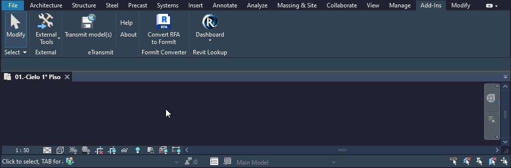

# SCADtools.Revit.UI.OptionsBar
Represents a custom options bar that will be displayed in the native Revit options bar.

Its main methods are: **Show()** and **Hide()**.

The OptionsBar library provides a set of predefined user-friendly controls that can be added to the options bar, such as **Button**, **LabelCheckBox**, **LabelComboBoxImage**, **LabelComboBox**, **LabelTextBox**, and **Separator**. Moreover, for users seeking further customization, the library allows the incorporation of user-defined controls. With these features, you can easily integrate a custom options bar into the Revit interface, allowing the user to access different settings without needing to open often annoying dialog boxes. Additionally, this library supports the integration of the custom options bar in conjunction with the native Revit options bar. Below, you'll find some examples of how this options bar is displayed.

## OptionsBar in Revit 2023
**Below is the integration of a custom options bar with the native Revit options bar.**

## OptionsBar in Revit 2024
**Light Theme**

**Dark Theme**

## :floppy_disk: Download
You can reference the DLL in a Visual Studio project the same way you load any external library.
| Version                      | DLL File                                                                                |
|:-----------------------------|:----------------------------------------------------------------------------------------|
| Revit 2023                   | -- |
| Revit 2024                   | -- |

## :rocket: Making
- The DLL files are made using [**Visual Studio**](https://github.com/microsoft) 2022.

## :keyboard: Code example
